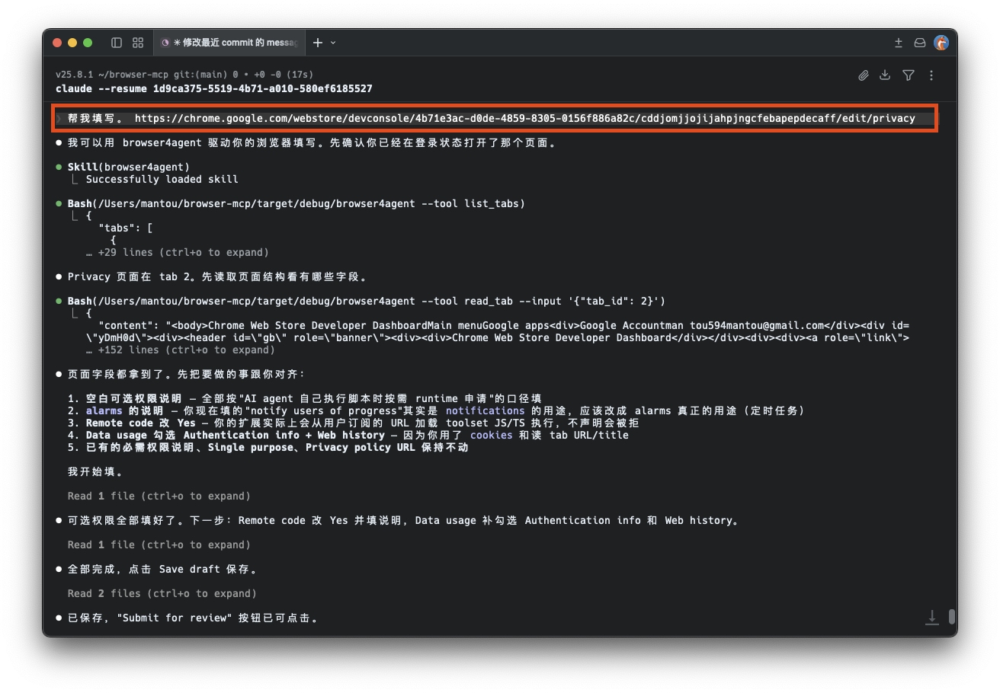
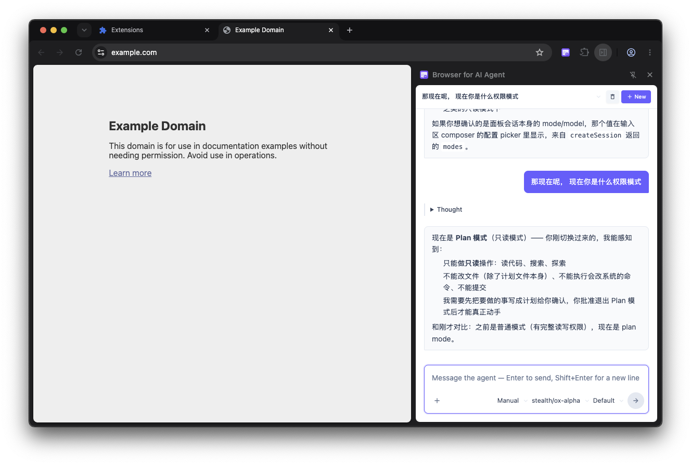

# Browser for AI Agent

[English](./README.md) | [中文](./README.zh-CN.md)

[](https://chromewebstore.google.com/detail/cddjomjjojijahpjngcfebapepdecaff)
[](https://microsoftedge.microsoft.com/addons/detail/kgofhkkibnooojbchfppjblmajdcboib)
[](https://addons.mozilla.org/firefox/addon/browser4agent@xianqiao.wang)
[](https://github.com/mantou132/browser4agent/releases/latest)

A browser extension that lets AI agents read browser tab content and drive the browser.



- **Read content** — page text, cookies, localStorage, page errors, screenshots, and more.
- **Drive the browser** — manage tabs and windows from a background script the agent writes itself.
- **Run scripts in a tab** — agents can write one-off scripts on the fly; complex flows should ship as [page tools](#page-tools) and be called directly.
- **Agent panel** — chat with a locally installed coding agent like Claude Code in DevTools or the side panel, next to the page it's driving.

> ⚠️ **Security**
> - Make sure your AI agent environment is not vulnerable to prompt injection — otherwise an attacker can read your browser data through the extension.
> - Only install page tools from sources you trust; a malicious tool can execute arbitrary scripts in your browser.

## Page tools

Agents can call tools scoped to the current tab. Two sources:

- **Subscribed toolsets** — subscribe from the in-extension marketplace (or paste any URL in settings); available tools are filtered by the tab URL.
- **Developer-provided** — page authors register tools via the [WebMCP][webmcp] API.

[webmcp]: https://webmachinelearning.github.io/webmcp/

## Agent panel

Open the **Agent** panel in DevTools — or as the browser's side panel — to chat with a locally installed coding agent like Claude Code about the page you're on. Sessions stream live, support attachments and permission prompts, and you can keep several sessions and switch between them. Requires the Native Host, plus the agent installed and logged in locally.



## Install

1. Install the extension from your browser's store ([Chrome](https://chromewebstore.google.com/detail/cddjomjjojijahpjngcfebapepdecaff) · [Edge](https://microsoftedge.microsoft.com/addons/detail/kgofhkkibnooojbchfppjblmajdcboib) · [Firefox](https://addons.mozilla.org/firefox/addon/browser4agent@xianqiao.wang)).
2. The welcome page that opens after install walks you through:
   - downloading and registering the **Native Host**,
   - optionally wiring up **MCP** for any of Codex, Claude Code, VS Code, Cursor, and Zed that it detects,
   - optionally installing the **Skill** for those same agents.

> **Note:** the extension listens on a local port, so if it is installed and active in multiple browsers at the same time, only one of them will work.

### Manual install

Prefer not to use a store? Grab `extension-chrome.zip` or `extension-firefox.zip` from the [latest release](https://github.com/mantou132/browser4agent/releases/latest), unzip, then load it unpacked:

- **Chrome / Edge** — open `chrome://extensions`, enable *Developer mode*, click *Load unpacked*, choose the unzipped folder.
- **Firefox** — open `about:debugging`, click *Load Temporary Add-on*, choose `manifest.json` inside the unzipped folder.

## CLI

After setup, `browser4agent` is also a one-shot CLI that forwards a single tool call to the running Native Host — handy for shell scripts and quick checks:

```bash
browser4agent --tool list_tabs
browser4agent --tool read_tab --input '{"tab_id": 123}'
echo '{"tab_id":123}' | browser4agent --tool read_tab --stdin
browser4agent --tool read_tab --help   # inspect a tool's input schema
```

## Build from source

```bash
# Browser extension, output in extension/dist/<browser>
pnpm -C extension run build --browser=chrome
# Native Host — running the binary with no arguments enters setup mode
cargo run
```

Load `extension/dist/<browser>` via *Load unpacked* above.

## Privacy policy

Browser for AI Agent processes browser data only to provide its core MCP browser automation features. Depending on the user's request, the extension may access tab metadata, page content, cookies, localStorage, page errors, screenshots, and toolset configuration. Data is sent only to the local Native Messaging Host and the user-configured MCP client / AI agent. We do not sell user data, use it for advertising, or use it for unrelated purposes. Only connect AI agents you trust, and only install toolsets you trust.
