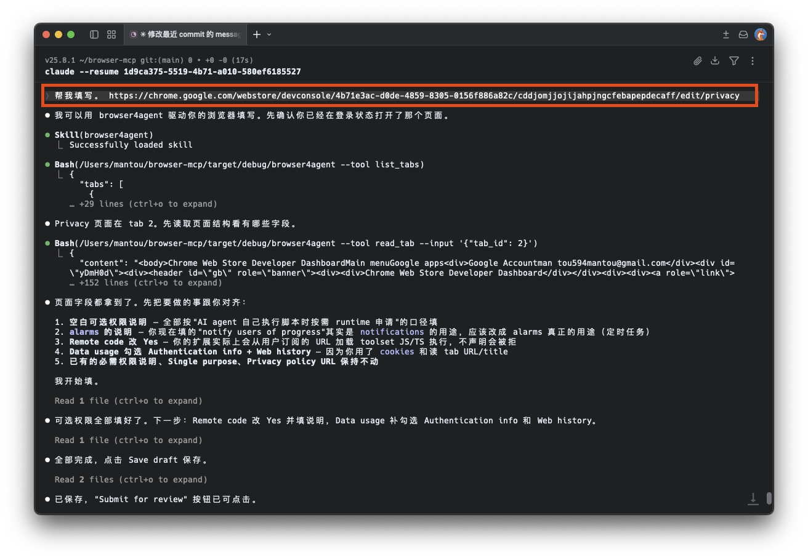
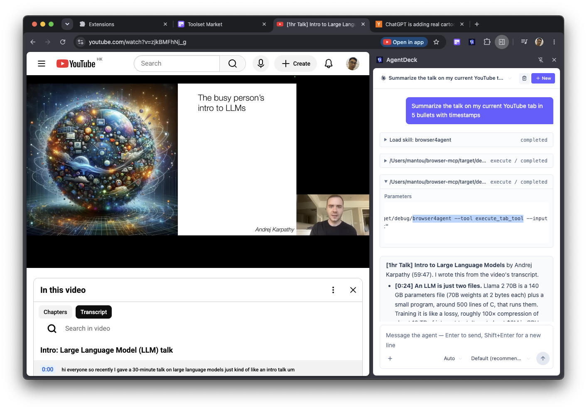

# Browser for AI Agent

[English](./README.md) | [中文](./README.zh-CN.md)

[](https://chromewebstore.google.com/detail/cddjomjjojijahpjngcfebapepdecaff)
[](https://microsoftedge.microsoft.com/addons/detail/kgofhkkibnooojbchfppjblmajdcboib)
[](https://addons.mozilla.org/firefox/addon/browser4agent@xianqiao.wang)
[](https://github.com/mantou132/browser4agent/releases/latest)

**Let any AI agent use your real browser.** Claude Code, Codex, Cursor, VS Code, Zed and Antigravity connect over MCP — or through a CLI Skill — to Chrome, Edge or Firefox, with your logged-in sessions. Plus page tools: userscripts for AI agents.



> ⚠️ An agent connected to this extension can do what you can do in your browser. Read [Security](#security) before connecting one.

## Why browser4agent

- **Any agent, any browser.** Works with the agents you already use — MCP where they support it, a CLI Skill everywhere else — and with Chrome, Edge and Firefox. No vendor lock-in, no separate AI browser, and it works even where a vendor's own browser extension isn't available to you.
- **Your real, logged-in browser.** Agents work in your tabs with your sessions, so there's no headless browser to log into again.
- **Page tools, shared like userscripts.** Site-specific tools that return clean, structured data. On YouTube, reading an hour-long talk's page yields none of what was said; `get_transcript` returns all 1,162 timestamped lines in 1 second. On a 682-comment Hacker News thread, `get_thread` returns the 45 top-level comments in ~6k tokens instead of ~142k for the page ([benchmark](./docs/benchmarks.md)). Subscribe from the in-extension market or contribute to [browser4agent-toolsets](https://github.com/mantou132/browser4agent-toolsets), where every toolset is reviewed in a public pull request. Sites can also expose their own tools through [WebMCP][webmcp].
- **Built for web developers.** Page errors, cookies, localStorage, screenshots, and Chrome DevTools Protocol access for network bodies and low-level debugging — see the [case studies](./docs/cases.md).
- **Local and private.** Your browser and your agent talk directly on your machine: no cloud relay, no telemetry.

## Install

1. Install the extension from your browser's store ([Chrome](https://chromewebstore.google.com/detail/cddjomjjojijahpjngcfebapepdecaff) · [Edge](https://microsoftedge.microsoft.com/addons/detail/kgofhkkibnooojbchfppjblmajdcboib) · [Firefox](https://addons.mozilla.org/firefox/addon/browser4agent@xianqiao.wang)).
2. The welcome page that opens after install walks you through:
   - downloading and registering the **Native Host**,
   - optionally wiring up **MCP** for any of Codex, Claude Code, VS Code, Cursor, Zed, and Antigravity that it detects,
   - optionally installing the **Skill** for those same agents.

On macOS (Apple Silicon or Intel) and Linux, install the Native Host with Homebrew, then run it once to start setup:

```bash
brew install mantou132/tap/browser4agent && browser4agent
```

On Windows, use Scoop:

```powershell
scoop bucket add mantou132 https://github.com/mantou132/scoop-bucket; scoop install browser4agent; browser4agent
```

> The binaries are not code-signed. If you download one directly on macOS and Gatekeeper blocks it, run `xattr -d com.apple.quarantine ./browser4agent` first.

> **Note:** the extension listens on a local port, so if it is installed and active in multiple browsers at the same time, only one of them will work.

### Manual install

Prefer not to use a store? Grab `extension-chrome.zip` or `extension-firefox.zip` from the [latest release](https://github.com/mantou132/browser4agent/releases/latest), unzip, then load it unpacked:

- **Chrome / Edge** — open `chrome://extensions`, enable *Developer mode*, click *Load unpacked*, choose the unzipped folder.
- **Firefox** — open `about:debugging`, click *Load Temporary Add-on*, choose `manifest.json` inside the unzipped folder.

## Control your browser from any agent (MCP / Skill)

Agents with MCP support work out of the box; agents that don't take MCP config can still drive everything through the [`browser4agent` CLI](#cli) via a Skill or plain shell commands. Setup detects Codex, Claude Code, VS Code, Cursor, Zed, and Antigravity and offers to configure them for you.

What the agent gets:

- **Read content** — page text, cookies, localStorage, page errors, screenshots, and more.
- **Drive the browser** — manage tabs and windows from a background script the agent writes itself.
- **Run scripts in a tab** — agents can write one-off scripts on the fly; complex flows should ship as [page tools](#page-tools) and be called directly.
- **Debug with CDP** — Chromium-only tools for network bodies/headers and other low-level visibility.

### Page tools

Agents can call tools scoped to the current tab. Two sources:

- **Subscribed toolsets** — subscribe from the in-extension marketplace (or paste any URL in settings); available tools are filtered by the tab URL. Community toolsets live in [browser4agent-toolsets](https://github.com/mantou132/browser4agent-toolsets) — pull requests welcome.
- **Developer-provided** — page authors register tools via the [WebMCP][webmcp] API.



### CLI

After setup, `browser4agent` is also a one-shot CLI that forwards a single tool call to the running Native Host — handy for shell scripts and quick checks:

```bash
browser4agent --tool list_tabs
browser4agent --tool read_tab --input '{"tab_id": 123}'
echo '{"tab_id":123}' | browser4agent --tool read_tab --stdin
browser4agent --tool read_tab --help   # inspect a tool's input schema
```

### Case Studies

- [High-Frequency UI Animation Profiling & Frame-by-Frame Tuning](./docs/cases.md#case-1-high-frequency-ui-animation-profiling--frame-by-frame-refactoring-card-expansion-tuning)
- [View All Case Studies](./docs/cases.md)

## Security

- **Prompt injection is the main risk.** Pages the agent reads can contain instructions aimed at it, and the agent holds your browser's powers: cookies, logged-in sessions, scripts in any tab. Use an agent that asks before running tools, and don't let it browse untrusted content unattended.
- **Page tools are scripts that run in your pages.** Only subscribe to toolsets you trust. The market shows every tool's code before you subscribe or update, and community toolsets are reviewed in public pull requests.
- **Who can reach the bridge.** The Native Host serves MCP on `127.0.0.1:39271` only and rejects requests whose `Host` isn't loopback, which blocks DNS rebinding. Web pages can't call it: it accepts only `application/json` requests, which need a CORS preflight it never grants. Any program running as your user can call it — the same trust boundary as your browser profile on disk.

## Build from source

```bash
# Browser extension, output in extension/dist/<browser>
pnpm -C extension run build --browser=chrome
# Native Host — running the binary with no arguments enters setup mode
cargo run
```

Load `extension/dist/<browser>` via *Load unpacked* above.

## Privacy policy

Browser for AI Agent processes browser data only to provide its core features — MCP browser automation. Depending on the user's request, the extension may access tab metadata, page content, cookies, localStorage, page errors, screenshots, and toolset configuration. Data is sent only to the local Native Messaging Host and the user-configured MCP client / AI agent. We do not sell user data, use it for advertising, or use it for unrelated purposes. Only connect AI agents you trust, and only install toolsets you trust.

- **No analytics or telemetry.**
- The Native Host makes no network requests. Its local log (`logs/browser4agent.log` in the app data directory) records only connection events, never page data.
- The extension contacts only the toolset market (listing, subscribing, liking and publishing toolsets) and the URLs of toolsets you subscribe to, without cookies. Market requests carry an anonymous random ID generated on install, used for likes and to verify who may update a published toolset; the market stores only its SHA-256 hash, and only for toolsets you publish.

[webmcp]: https://webmachinelearning.github.io/webmcp/
